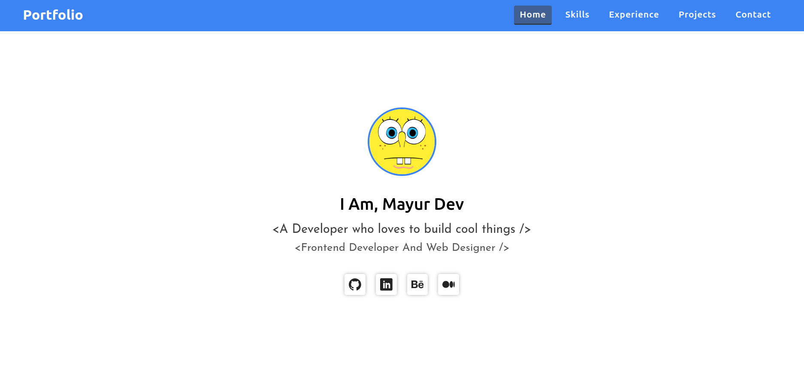
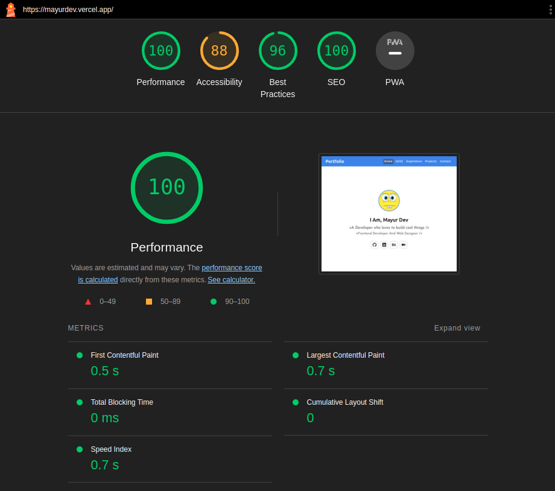

# Animated Portfolio 

A personal portfolio website built with React.js, featuring smooth animations powered by `Framer Motion`.

## 💻 Technologies used
- React
- Typescript
- React-Router-Dom
- Framer-motion
- HTML5
- CSS3/SASS

## Features
- **Interactive and engaging:** Smooth animations implemented with Framer Motion create a visually appealing and dynamic user experience.
- **React powered:** Built with React for a performant and scalable application.
- **Type safe with Typescript:** Enhances code maintainability and reduces bugs.
- **Easy navigation:** Utilizes React Router Dom for seamless navigation between different sections of the portfolio.
- **Modern styling:** Leverages SASS for efficient and maintainable stylesheets.

---------
### [Live Demo](https://mayurdev.vercel.app/) on Vercel
---------

## 📷 Screenshot

  

Lighthouse Speed

  

  
## Contributing
Pull requests and suggestions are welcome! Please create an issue on GitHub before making any significant changes.